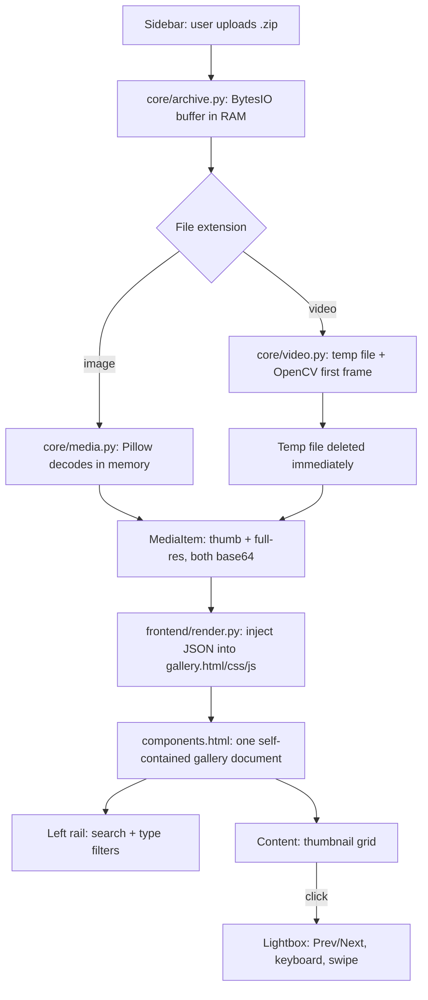

# 🛡️ Isolated ZIP Media Viewer

A Streamlit app that lets you upload a `.zip` file and browse the images and
videos inside it in a fast, application-style gallery — without ever
extracting the archive to disk. Everything is decompressed and decoded in
the container's memory, so it's safe to open archives you wouldn't want
touching a real filesystem.

## Features

- 📦 Upload a ZIP and inspect its contents — no unzip step, no temp folder
  of extracted files left behind
- 🖼️ Supports images: `.png` `.jpg` `.jpeg` `.webp` `.gif` `.bmp` `.tiff`
- 🎬 Supports videos: `.mp4` `.mov` `.avi` `.mkv` `.webm` `.m4v`
- 🗂️ Application-style layout: a left action rail (search, type filters,
  file counts) with the media grid filling the content area — not a plain
  vertical list
- 🔳 Uniform, cropped thumbnails so the gallery grid lines up neatly
  regardless of each file's original aspect ratio
- ▶️ Video thumbnails show a play-icon overlay generated from the first frame
- 🔍 Live filename search and All/Images/Videos filtering, both client-side
- 🖱️ A lightbox for full-size viewing with Prev/Next, keyboard arrow-key
  navigation, Esc to close, and touch swipe support — no page reloads
- 📐 Fully fits the viewport — no scrollbars, no wasted header/footer space

## Project Structure

```
.
├── app.py                  # Streamlit entrypoint — thin orchestration only
├── core/                   # Framework-agnostic processing logic
│   ├── __init__.py
│   ├── models.py             # MediaItem dataclass
│   ├── media.py                # Image thumbnailing, base64 encoding
│   ├── video.py                 # OpenCV first-frame extraction, MIME mapping
│   └── archive.py                # ZIP reading, routes entries by file type
├── frontend/                # The gallery UI, rendered as one HTML component
│   ├── __init__.py
│   ├── gallery.html            # Structure only (placeholders for CSS/JS/data)
│   ├── gallery.css               # All styling — rail layout, cards, lightbox
│   ├── gallery.js                  # Grid rendering, search/filter, lightbox,
│   │                                 keyboard + swipe navigation
│   └── render.py                    # Loads the 3 files above, injects data
├── .streamlit/
│   └── config.toml          # Hides Streamlit's default Deploy/menu chrome
├── requirements.txt
├── Dockerfile
├── compose.yaml
├── Guide.md                 # Run, rebuild, and troubleshooting reference
└── README.md                # This file
```

## Quick Start

```bash
podman machine start          # if not already running
podman compose up --build     # --build forces a fresh image with your latest code
```

Then open **http://localhost:8501** in your browser.

See [Guide.md](./Guide.md) for the full run/rebuild workflow, common
pitfalls, and a troubleshooting table.

## How It Works

1. **Upload** — the sidebar's file uploader (a native Streamlit widget)
   sends the ZIP file's bytes into an in-memory `BytesIO` buffer. Nothing
   touches disk yet.
2. **Parse & route** (`core/archive.py`) — `zipfile.ZipFile` reads the
   archive's entries; each one is routed to the image or video pipeline
   based on its extension.
3. **Image pipeline** (`core/media.py`) — Pillow decodes bytes directly
   from the in-memory buffer, produces a uniform cropped thumbnail and a
   dimension-capped full-resolution version, and both are base64-encoded.
4. **Video pipeline** (`core/video.py`) — video bytes are briefly written
   to a temp file (OpenCV's `VideoCapture` requires a real file path), the
   first frame is grabbed for the thumbnail, and the temp file is deleted
   immediately after. The full video is base64-encoded directly from the
   in-memory bytes for playback — no temp file needed for that part.
5. **Render** (`frontend/render.py`) — the processed `MediaItem` list is
   JSON-serialized and injected into `gallery.html`, along with the CSS and
   JS files, producing one self-contained HTML document.
6. **Display** — that document is rendered via Streamlit's
   `components.html`, which runs entirely client-side from then on: the
   left rail (search, type filters, counts) and the media grid never need a
   server round-trip to interact with, and the lightbox opens instantly
   with keyboard, click, and swipe navigation.

### Architecture Diagram



> The diagram above is Mermaid syntax — it renders automatically on GitHub
> and in most Markdown viewers that support Mermaid (e.g. VS Code with the
> Markdown Preview Mermaid extension).

## Dependencies

| Package                  | Purpose                                 |
| ------------------------ | --------------------------------------- |
| `streamlit`              | Web app framework, file upload, sidebar |
| `Pillow`                 | Image decoding, resizing, thumbnailing  |
| `opencv-python-headless` | Extracting a video's first frame        |

## Notes on Isolation

- Images never touch disk — decoded straight from the in-memory ZIP buffer.
- Videos are the one exception: OpenCV's frame-reading API needs a real file
  path, so video bytes are written to a temp file just long enough to grab
  one frame, then the temp file is deleted. If strict "nothing ever touches
  disk" isolation is a hard requirement, this is the piece to swap out (e.g.
  for a library that can read video frames from an in-memory stream).
- The gallery intentionally has no file-size cutoff — the point of running
  this in a container is that it's safe to open archives regardless of
  content or size.

## Contributing / Extending

Because processing logic (`core/`) has no Streamlit imports, it can be
tested independently of the app:

```python
from core.archive import process_zip

with open("some.zip", "rb") as f:
    items, errors = process_zip(f.read())
```

The frontend (`frontend/gallery.html` / `.css` / `.js`) is plain, dependency-free
HTML/CSS/JS — no build step, no bundler — so it can be opened and edited
directly in any editor with real syntax highlighting.
